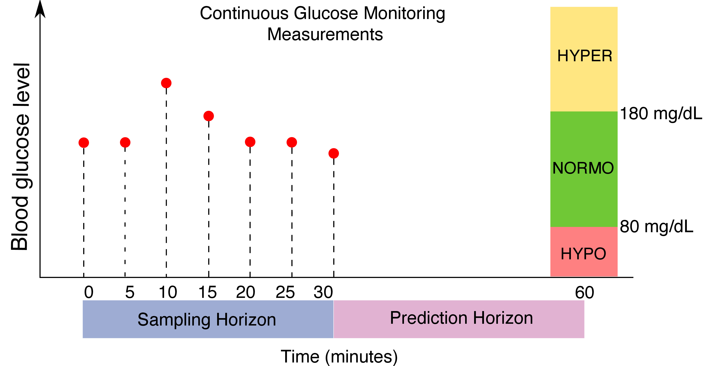

以下是文件的翻译：

---

# 准确的血糖水平预测

此仓库用于论文[《深度迁移学习和数据增强改善2型糖尿病患者的血糖水平预测》](https://www.nature.com/articles/s41746-021-00480-x)。



## 安装

我们建议您通过`Anaconda`或`Pyenv`创建一个虚拟环境，然后激活虚拟环境并运行：
```
>> make dev
```

我们使用的是tensorflow 1.15.0。

## 针对 *OhioT1DM* 数据集的训练和测试

要测试OhioT1DM数据集，请在根目录下创建一个名为`data`的文件夹：
```
>> mkdir data/
```

然后，从[此处](http://smarthealth.cs.ohio.edu/OhioT1DM-dataset.html)下载公开数据集*OhioT1DM*，并将解压后的文件夹`OhioT1DM`移动到`data`文件夹中。（请注意，要使用该数据集，您需要通过提供的链接进行申请，我们无法为您提供数据集。）

要使用我们的最佳配置进行*OhioT1DM*数据集的训练和测试，请运行：
```
>> cd accurate_bg
>> python3 ohio_main.py --epoch 150
```

默认的预测范围是6，相当于30分钟。要将预测范围调整为1小时，请修改上述代码块中的最后一行命令：
```
>> python3 ohio_main.py --epoch 150 --prediction_horizon 12
```

## 参考

如果您发现这个仓库或我们的工作有帮助，我们鼓励您引用下面的论文：
```
@article{deng2021deep,
  title={Deep transfer learning and data augmentation improve glucose levels prediction in type 2 diabetes patients},
  author={Deng, Yixiang and Lu, Lu and Aponte, Laura and Angelidi, Angeliki M and Novak, Vera and Karniadakis, George Em and Mantzoros, Christos S},
  journal={NPJ Digital Medicine},
  volume={4},
  number={1},
  pages={1--13},
  year={2021},
  publisher={Nature Publishing Group}
}
```

---

希望这对您有帮助！如果您还有其他问题或需要进一步的帮助，请随时告诉我。